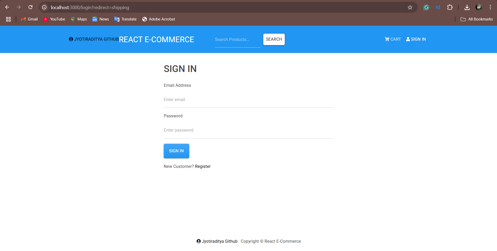
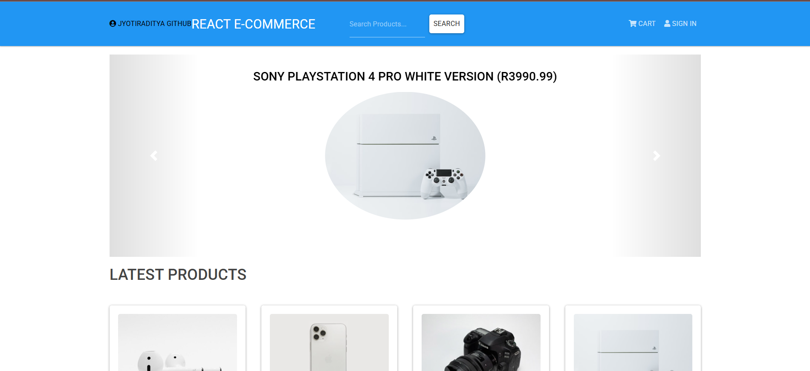
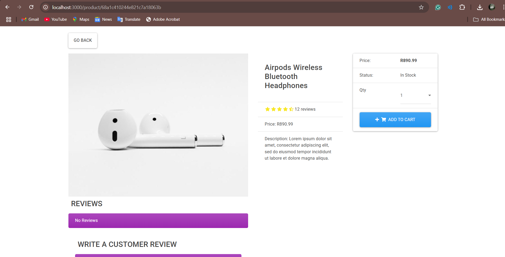
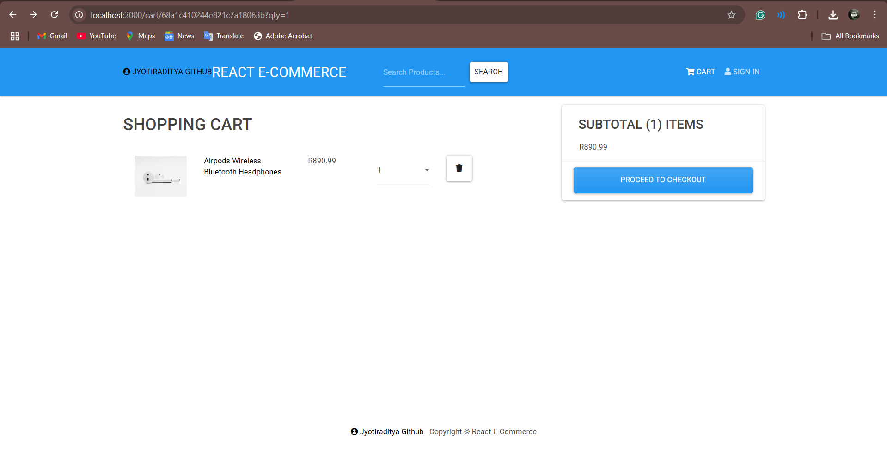
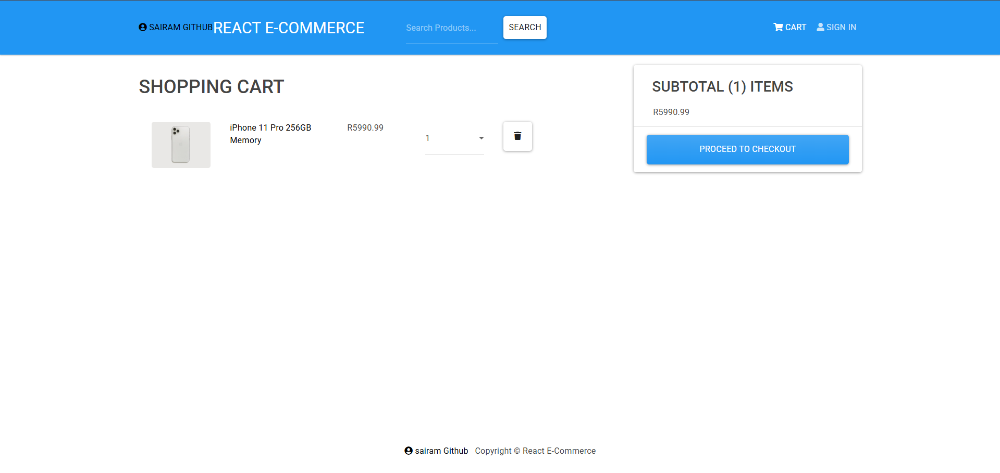

# 🛒 Full-Stack E-Commerce Website

A simple yet robust e-commerce web application built with the modern MERN stack, featuring all essential shopping functionalities: product catalog, cart, payments, and user authentication.

## 🚀 Tech Stack

**Frontend:**  
- [React.js](https://react.dev/) – Interactive UI & seamless user experience

**Backend:**  
- [Node.js](https://nodejs.org/) & [Express.js](https://expressjs.com/) – RESTful API, server-side logic

**Database:**  
- [MongoDB](https://www.mongodb.com/) (NoSQL) & [Mongoose](https://mongoosejs.com/) – Flexible data storage, powerful querying

**Authentication & Security:**  
- [JSON Web Tokens (JWT)](https://jwt.io/) – Secure, stateless authentication
- [bcryptjs](https://github.com/dcodeIO/bcrypt.js/) – Password hashing

---

## 🏗️ Full-Stack Architecture

- **Frontend (React):**  
  Dynamic shopping pages, cart management, product browsing, and order placement, all interacting with backend APIs.

- **Backend (Node/Express):**  
  Handles business logic, user authentication, and data validation. Serves API routes for products, users, and orders.

- **Database (MongoDB + Mongoose):**  
  Central to the stack:  
  - Stores products, user profiles, orders, and cart items as documents.
  - Enables fast, flexible queries for real-time user experience.
  - Mongoose ODM provides schema validation and easy model management.

- **Authentication:**  
  - JWT tokens enable secure login sessions.
  - bcryptjs hashes user passwords before saving to the database.

---

## ✨ Features

- Browse products and view details
- Add/remove items from cart
- User sign-up, login, and authentication
- Secure payments page (mock implementation)
- Order history and profile management
- Responsive design for mobile & desktop

---

## ⚡ Getting Started

1. **Clone the repo**
   ```bash
   git clone https://github.com/Jyotiraditya-Panda-web/fullstack-ecommerce.git
   cd fullstack-ecommerce
   ```

2. **Install dependencies**
   ```bash
   # Frontend
   cd client
   npm install

   # Backend
   cd ../server
   npm install
   ```

3. **Set up environment variables**
   - Create a `.env` file in the `server` directory:
     ```
     MONGO_URI=your_mongodb_connection_string
     JWT_SECRET=your_jwt_secret
     ```

4. **Run the app**
   ```bash
   # Start backend
   cd server
   npm start

   # Start frontend
   cd ../client
   npm start
   ```

---

## 📸 Screenshots

<!-- Add your screenshots here! Example: -->







---

## 📚 License

This project is MIT licensed.

---

> Built with ❤️ using the MERN stack – empowering scalable, secure, real-world web applications.
